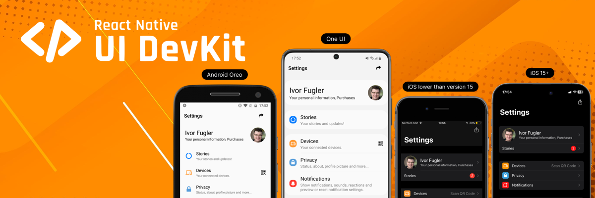
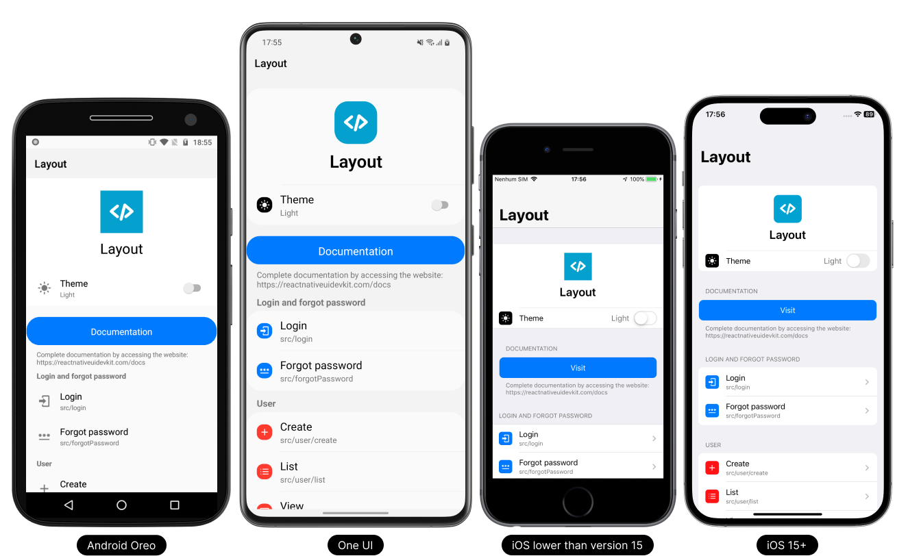

<p align="center">
  <a href="https://reactnativeuidevkit.com/">
    
  </a>
</p>

# Layout
Before you get started with our React Native UI DevKit Layout, we'll provide a simplified overview.

## What is React Native UI DevKit Layout?

React Native UI DevKit Layout is a project that includes the use of some standard layouts in applications using [React Native UI DevKit](https://reactnativeuidevkit.com) package. You can use some ready-made layouts to have a starting point and facilitate implementation in your projects.


<p align="center">
  <a href="https://github.com/reactnativeuidevkit/react-native-ui-devkit-layout">
    
  </a>
</p>

## Where does it apply?

React Native UI DevKit components can be used simply and efficiently in your applications developed in React Native.

Transform the experience of users who use or will use your application into a native navigability experience according to the platform and version for Android and iOS.

## Getting started

### Installation
```bash
 git clone https://github.com/reactnativeuidevkit/react-native-ui-devkit-layout.git
```

```bash npm2yarn
 npm install
```

If you're on a Mac and developing for iOS, you need to install the pods [(via Cocoapods)](https://cocoapods.org/) to complete the linking.
```bash 
 cd ios && pod install
```

Let the games begin,

```bash
 npx react-native run-android
```

Have a fun

## Features

See here all the features that the React Native UI DevKit has.

### Provider
-  [RNUIDevKitProvider](https://reactnativeuidevkit.com/docs/introduction/provider)

### Components

-  [Action](https://reactnativeuidevkit.com/docs/Components/Action)
-  [Button](https://reactnativeuidevkit.com/docs/Components/Button)
-  [Card](https://reactnativeuidevkit.com/docs/Components/Card)
-  [Checkbox](https://reactnativeuidevkit.com/docs/Components/Checkbox)
-  [Collapsible](https://reactnativeuidevkit.com/docs/Components/Collapsible)
-  [Divider](https://reactnativeuidevkit.com/docs/Components/Divider)
-  [FlatList](https://reactnativeuidevkit.com/docs/Components/FlatList)
-  [Icon](https://reactnativeuidevkit.com/docs/Components/Icon)
-  [Item](https://reactnativeuidevkit.com/docs/Components/Item)
-  [List](https://reactnativeuidevkit.com/docs/Components/List)
-  [Radio](https://reactnativeuidevkit.com/docs/Components/Radio)
-  [Separator](https://reactnativeuidevkit.com/docs/Components/Separator)
-  [Swipeable (iOS)](https://reactnativeuidevkit.com/docs/Components/Swipeable)
-  [Switch](https://reactnativeuidevkit.com/docs/Components/Switch)
-  [TextInput](https://reactnativeuidevkit.com/docs/Components/TextInput)

### Fonts

-  [TitleFontSize](https://reactnativeuidevkit.com/docs/Fonts/TitleFontSize)
-  [MediumFontSize](https://reactnativeuidevkit.com/docs/Fonts/MediumFontSize)
-  [DescriptionFontSize](https://reactnativeuidevkit.com/docs/Fonts/DescriptionFontSize)

### Functions

-  [useColors()](https://reactnativeuidevkit.com/docs/Functions/useColors)
-  [marginTop()](https://reactnativeuidevkit.com/docs/Functions/marginTop)
-  [marginBottom()](https://reactnativeuidevkit.com/docs/Functions/marginBottom)
-  [marginHorizontal()](https://reactnativeuidevkit.com/docs/Functions/marginHorizontal)
-  [paddingTop()](https://reactnativeuidevkit.com/docs/Functions/paddingTop)
-  [paddingBottom()](https://reactnativeuidevkit.com/docs/Functions/paddingBottom)
-  [paddingHorizontal()](https://reactnativeuidevkit.com/docs/Functions/paddingHorizontal)
-  [borderRadius()](https://reactnativeuidevkit.com/docs/Functions/borderRadius)
-  [androidOldVersion()](https://reactnativeuidevkit.com/docs/Functions/androidOldVersion)
-  [iosOldVersion()](https://reactnativeuidevkit.com/docs/Functions/iosOldVersion)

## Continuous Innovation

The React Native UI DevKit continuous innovation protocol is constantly evolving through research and development. It consists of two steps: the first is the analysis of the Android and iOS platforms and their versions and updates, to test and deploy the latest updates. The second is our testing ground to validate new features and improvements before they are implemented in the React Native UI DevKit package update.

## Contributing

If you have any questions, suggestions or complaints please send us an email at feedback@reactnativeuidevkit.com.

## License

Licensed under The MIT License.<br />Copyright © 2023 React Native UI DevKit - All rights reserved.<br />Copyright © 2023 React Native UI DevKit Layout - All rights reserved.

See [license](./LICENSE) for more information.